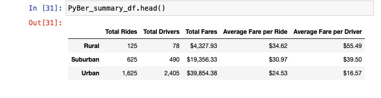
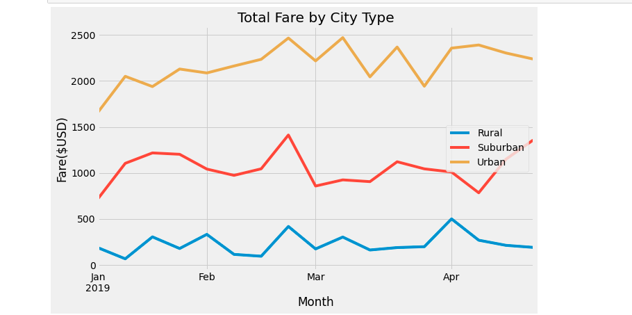

# PyBer_Analysis
Analysis of ride share data across rural, suburban and urban cities. 

##Overview of the Analysis
This analysis require exploratory analysis of ride sharing data. Looking at different types of cities. The analysis will allow PyBer leadership to identify shortcoming in PyBer's service. It will also enable leadership to address issues of accessability and affordability across city types. 

## Results

Above is a summary of ride-share data by city type. we can see from the summary that urban cities have the highest number of rides and drivers. Urban cities have more than 200% more the drivers than in rural communitites. Rural communitite have the highest average fare per ride. Based on the summmary, it is easy to see that the more rides and driver, the lower the ride cost. We also see that that the toal fares is rural communities does not hit $5,000 compared to the $19,000 in suburban communities and $39,000 in urban communities. 

The line graph visiualizes total fares ($USD) across a 4 month period by city type. The graph shows that urban communitied consisitantly has a higher fare amount. The graph also shows that all three cities follow somewhat of the same pattern. Rising and dipping at the same time. 

## Summary

Based on my analysis, leadership may consider the followng to lessen the disparities
  1. Conduct a campaign to incentivize drivers and riders in rural communities. We see that the more rides, the lower the average fare. A campaign that incetivizes       riders would help to increase ride-share use and meeting that need by having dependable drivers would increase affordability. 
  2. Inhternally, it may be helpful to identify a goal average far cost for each community type that could be used as a working goal. This would help with planning       and holding the company accountable to its commitment of having affordable and acccessable service. 
  3. The end of February appears to be a time where total fares goes in all city types goes up. It may be good for PyBer to assess what cause this increase and if         there is a way to maintain that increase in ride share for more than 2 weeks. 

